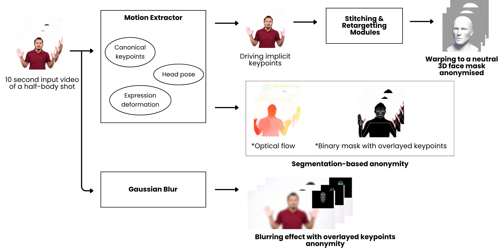
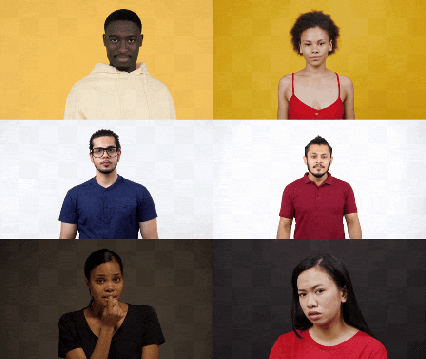

# Forensic Face Anonymisation with Micro-Expression Retention

<p align="center">
  SUTD Computer Vision Project (Team 1)
</p>

<p align="center">
  Ng Junhao Marcus | Pham Hong Quan Rose Evangeline Anne Dagman Destor Douglas Chun-hao Tan
</p>


## Abstract
Facial anonymisation is commonly used to protect the identity of witnesses in legal and forensic video testimony. However, conventional methods such as blurring, pixelation, and back-lit shadowing often suppress facial dynamics that may remain relevant for credibility assessment and human interpretation. 

This project studies face anonymisation as a privacy--utility trade-off in forensic, human-facing settings, where the goal is not only to conceal identity but also preserve non-identity facial signals.

<p align="center">

</p>


We compare four anonymisation strategies across identity leakage, micro-expression fidelity, usability, and deployment cost, focusing on whether anonymised representations remain interpretable for human observers in legal proceedings while reducing the risk of identity recovery. 

Our results frame forensic face anonymisation as a reproducible privacy--micro-expression--utility benchmark and indicate that representation-level approaches can offer a more balanced alternative to conventional visual redaction.

## Dataset
<p align="center">

</p>

- [25 curated out-of-the-wild](https://sutdapac-my.sharepoint.com/:f:/g/personal/rose_destor_mymail_sutd_edu_sg/IgAtzcqgArfnRae5yui2NGAsAcZdDtR7yTPxvx6hWVheULY?e=wydihS) 10-second video clips sourced from [Pexels](https://www.pexels.com/license/) (free for academic, non-commercial use)
- Balanced across gender, ethnicity (Asian: 8, African: 8, Caucasian: 9), and age group
- Covers a range of emotions: shock, fear, nervousness, confusion, excitement, and neutral
- Mix of frontal (15) and side-profile/partially occluded (10) viewpoints


## Anonymisation Pipeline

### 1. Landmark to 3D Avatar Mapping (LivePortrait)
> Retargets facial motion onto an identity-neutral 3D face mesh.


See repository:  https://github.com/Forensic-Face-Anon/Avatar-LivePortrait  
See results:  [OneDrive file](https://sutdapac-my.sharepoint.com/:f:/g/personal/rose_destor_mymail_sutd_edu_sg/IgAei8FaMV5rT6URxU2SqBf8AUjxDFGTrZOntO3TriQag2Q?e=hoMHGB)


### 2. Optical Flow (FacialFlowNet / DecFlow)
> Decomposes facial optical flow; discards all photometric appearance.

See repository: https://github.com/Forensic-Face-Anon/Optical-Flow-DecFlow   
See results:  [OneDrive file](https://sutdapac-my.sharepoint.com/:f:/g/personal/rose_destor_mymail_sutd_edu_sg/IgByiGLOv2xDR7aU_6zg7pE0AT_lnugGXW18ah0bBA8P9sM?e=9Ds6kB)

### 3. Binary Masking with Overlaid Keypoints (Masked Piper)
> Binary silhouette mask + overlaid MediaPipe kinematic keypoints.

See repository:  https://github.com/Forensic-Face-Anon/MaskedPiper  
See results:  [OneDrive file](https://sutdapac-my.sharepoint.com/:f:/g/personal/rose_destor_mymail_sutd_edu_sg/IgArZAWOlCPFT5-2-3fykXJhARc_WyssnPIOWtJAdkMHy2M?e=4OGcRZ)

### 4. Gaussian Blurring with Overlaid Keypoints (MediaPipe)
> Weak Gaussian blur for context + dense 478-point MediaPipe facial landmark overlay.

See repository: https://github.com/Hypernating/face-anonymisation  
See results:  [OneDrive file](https://sutdapac-my.sharepoint.com/:f:/g/personal/rose_destor_mymail_sutd_edu_sg/IgARLyoYKXTcQqLe2x4xgjsvAWDn0sJhlm7zvpsfLkyxCdo?e=rLmByE)

## Results Summary

| Model                  | Distractiveness | Human Usability      | Identity Leakage    | Inference Time | Rank   |
| ---------------------- | --------------- | -------------------- | ------------------- | -------------- | ------ |
| LivePortrait           | Low (1.2)       | ✅ Yes               | 80% privacy success | 43.7 s         | 🥇 1st |
| Masked-Piper           | Medium (3.9)    | ✅ Yes (global pose) | 72% privacy success | 44.4 s         | 🥈 2nd |
| Gaussian Blur + Mesh   | Low (2.3)       | ⚠️ With difficulty   | 56% privacy success | 15.2 s         | 🥉 3rd |
| DecFlow (Optical Flow) | Very High (5)   | ❌ No                | —                   | 48.3 s         | 4th    |

**Key finding:** Avatar-based reconstruction (LivePortrait) offers the best balance for human-facing forensic settings. Motion-only representations (optical flow) achieve strong machine-level privacy but are not interpretable by human observers.

## Evaluation Protocol

Each approach is evaluated on six criteria:

- **Distractiveness** — 1–5 Likert scale, human-rated
- **Human usability** — binary: can a human interpret emotional cues?
- **Identity leakage** — ArcFace cosine similarity (via DeepFace) between original and anonymised frames. [See code here](https://github.com/Forensic-Face-Anon/CosineSimilarity/tree/main).
- **Privacy success rate** — fraction of frames that fail face verification at a fixed threshold
- **Expression consistency** — benchmarked against prior literature (see Appendices B & C)
- **Inference time** — end-to-end wall-clock time under identical hardware


## Limitations

- Micro-expressions (40–500 ms) are difficult for **untrained** human evaluators to interpret regardless of anonymisation method
- Machine-level micro-expression fidelity does not guarantee human interpretability
- Audio was excluded; facial expression alone is an incomplete emotional channel
- ArcFace identity metrics are imperfect proxies for abstract representations (optical flow, landmarks)


## Acknowledgements

Video clips are sourced from [Pexels](https://www.pexels.com/license/) and attributed to: Tima Miroshnichenko, Ketut Subiyanto, Kampus Production, ShotPot, SHVETS production, and MART PRODUCTION.


## SDG Alignment

This work aligns with **SDG 10** (Reduced Inequalities) and **SDG 16** (Peace, Justice and Strong Institutions) by lowering barriers for vulnerable individuals to participate in legal proceedings through ethical use of technology.


## Citation

If you reference this work, please cite it as:

```
Marcus, N. J., Pham, H. Q., Destor, R. E. A. D., & Tan, D. C. (2026).
Forensic Face Anonymisation with Micro-Expression Retention. SUTD.
```